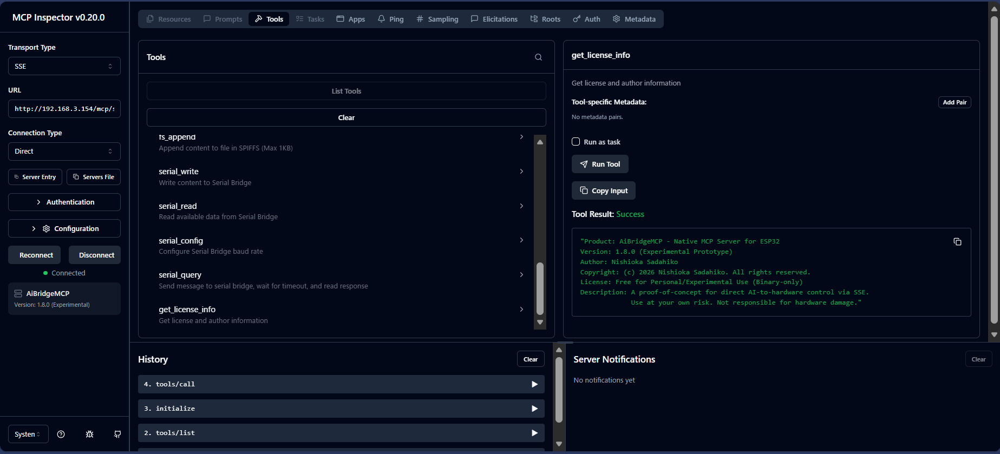

# AiBridgeMCP - World's First MCP Server on ESP32

This is the **first and only** implementation of a Model Context Protocol (MCP) server running natively on an ESP32 microcontroller. No Raspberry Pi. No PC proxy. Just a $5 board talking to Claude over SSE.

## 🚀 Key Breakthrough: Direct SSE Connection

Unlike many other MCP implementations that require a PC-side proxy,  
**AiBridgeMCP supports direct SSE (Server-Sent Events) transport**.  
This allows AI clients to establish a persistent connection directly to the ESP32 hardware over your local network.

## 🌟 Features

- **True Standalone**: No Python or Node.js proxy needed on the client side.  
- **Direct SSE Transport**: SSE for downstream (server → client) and HTTP POST for upstream (client → server).  
- **Alpaca Discovery**: Automatically finds ASCOM Alpaca compatible devices (such as **OnStepNinja** or **AiBridge**) in your network.  
- **Hardware Control**: Ready to integrate with telescope mounts including **NS-5000** and **OnStep** systems.

---

# AiBridgeMCP v1.8.0 Prototype (Experimental)

**This is an experimental release for developers and early adopters.**  
Please note that some features are incomplete or under development.

## ⚠️ Status & Limitations
- **Experimental Build**: This firmware is a prototype. Use at your own risk.
- **SSE Connection**: Confirmed working with **MCP Inspector v0.20.0**.
  - *Note: Direct SSE connection from Google Antigravity is currently not supported.*
- **ASCOM/Alpaca Tools**: Telescope control tools are currently disabled or unstable (IP/Timeout not implemented).

## ✅ Working Features
The following MCP tools are available in this version:

### File System (SPIFFS)
- `fs_list`: List files in the root directory.
- `fs_read`: Read file content (max 4KB).
- `fs_write`: Write content to a file (create/overwrite).
- `fs_append`: Append content to a file.
- `fs_delete`: Delete a file.

### Serial Bridge
Interact with external MCUs via UART.
- `serial_write`: Send data to the serial port.
- `serial_read`: Read data from the serial port.
- `serial_query`: Send command and wait for a response.
- `serial_config`: Change baud rate (Default: 115200bps).
  - *Note: Baud rate setting resets to 115200bps after a reboot.*
  - *Note: The hardware serial port can be switched via `SERIALONSTEP_SELECT_PIN`, but only [Serial](cci:1://file:///c:/Users/user/.gemini/antigravity/scratch/AiMCPserver/AiMCPserver_v1_0.ino:1622:0-1638:1) is fully tested.*

### Alpaca Discovery
- `alpaca_discover_start` / `alpaca_discover_result`: Discovery process should work.

## 🛠 Installation
Please refer to **ESP32 Firmware Flashing Guide.pdf** for flashing instructions.

